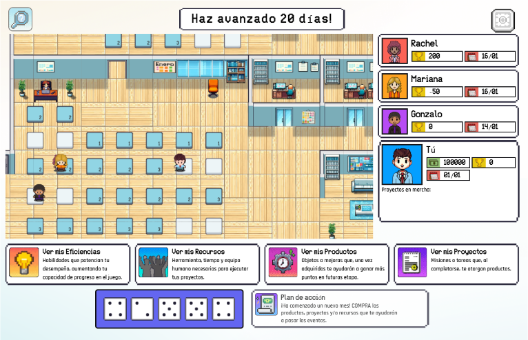
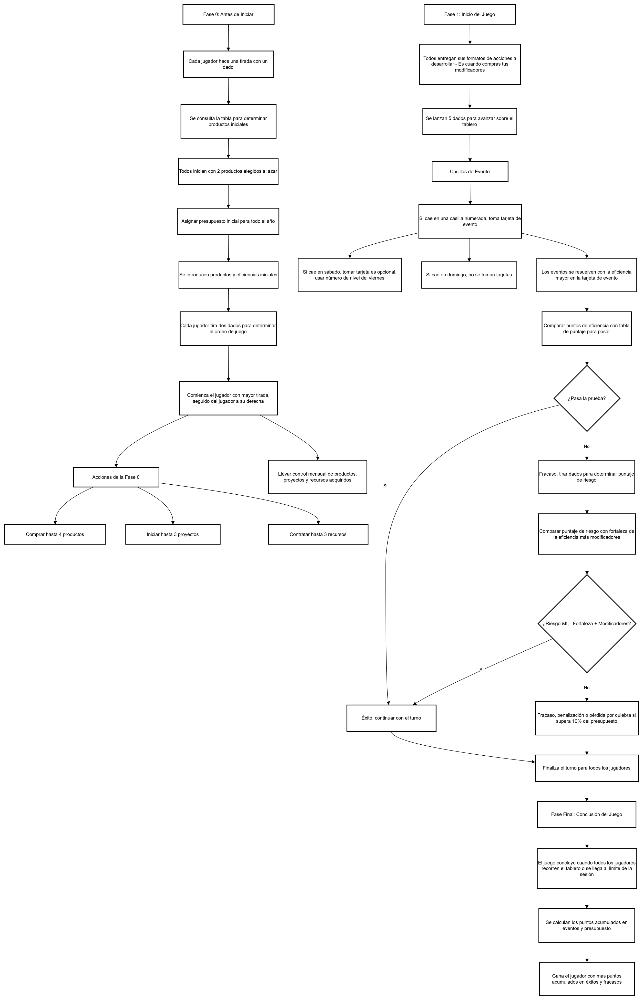
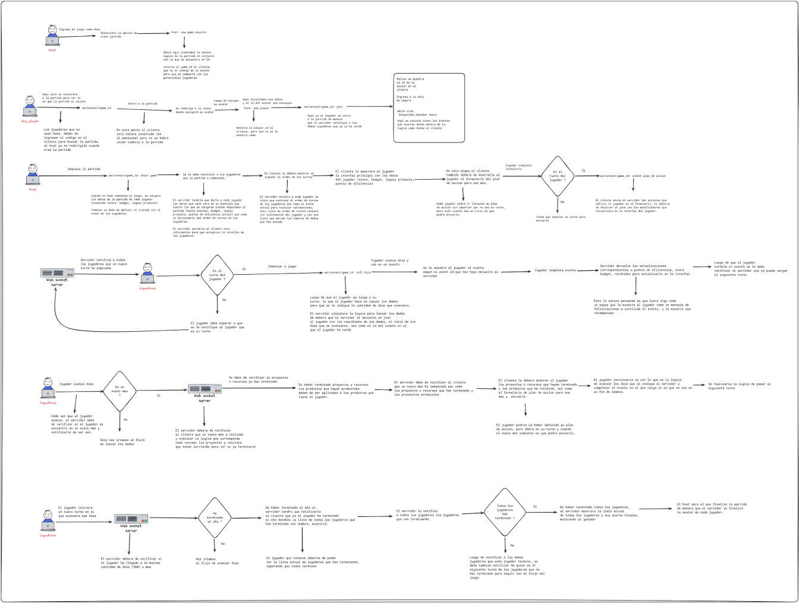
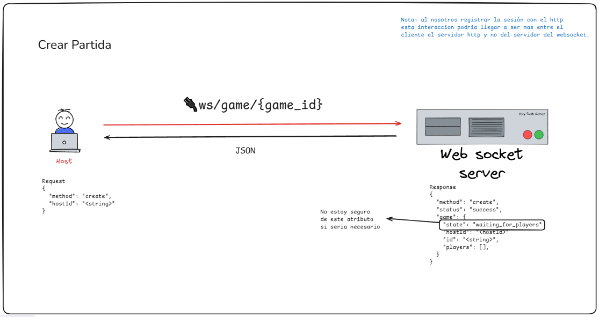
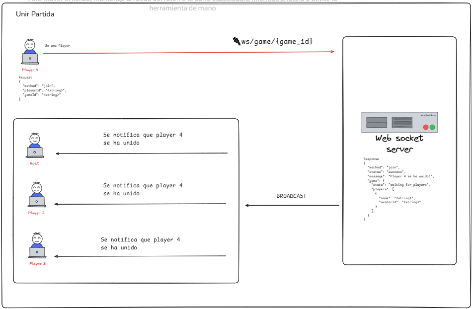
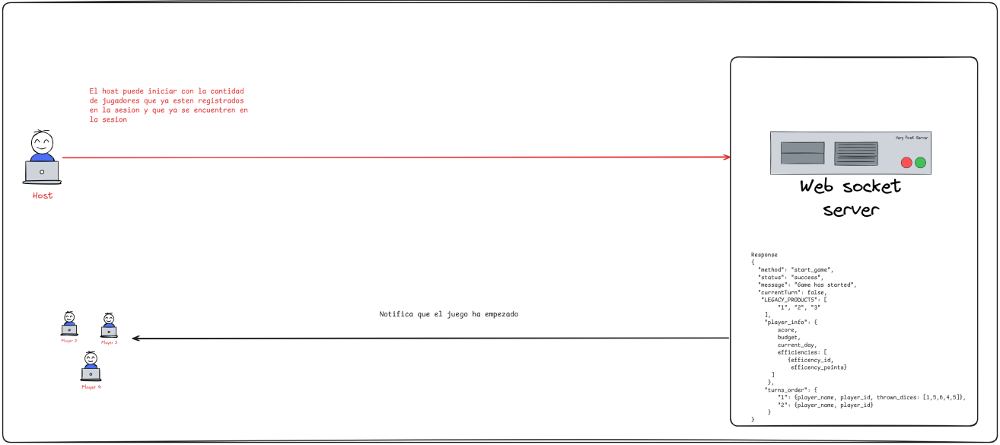
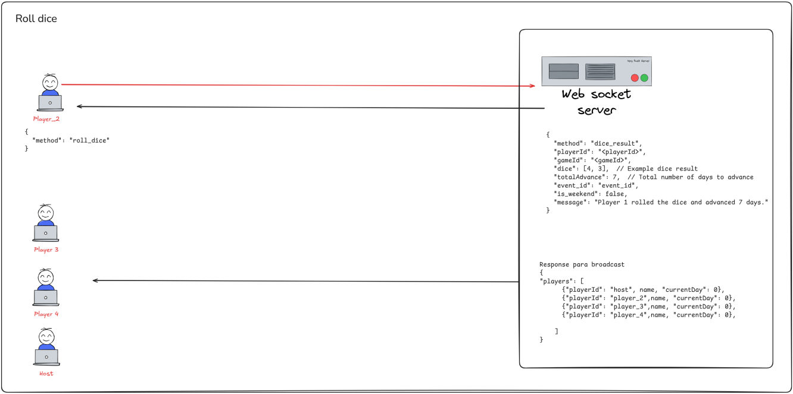
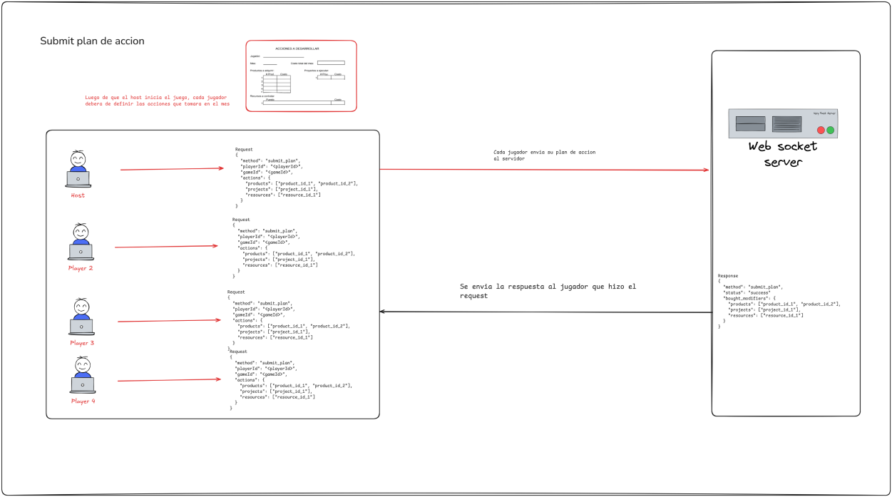
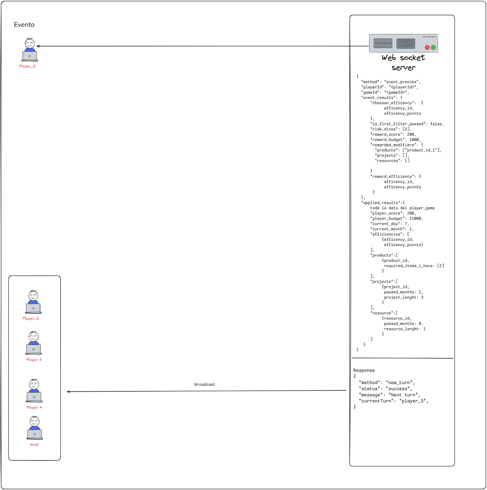

# Challenge Doctums API

## Tabla de contenidos
- [Challenge Doctums API](#challenge-doctums-api)
  - [Tabla de contenidos](#tabla-de-contenidos)
  - [Descripción](#descripción)
  - [Comunicación](#comunicación)
  - [Instrucciones para la instalación y ejecución](#instrucciones-para-la-instalación-y-ejecución)
    - [1. Activacion del entorno de python venv](#1-activacion-del-entorno-de-python-venv)
    - [2. Instalación de dependencias](#2-instalación-de-dependencias)
    - [3. Ejecución del proyecto](#3-ejecución-del-proyecto)
  - [Dinámica de la lógica](#dinámica-de-la-lógica)
  - [dispatcher\_handler.py](#dispatcher_handlerpy)
    - [Funcionalidades Principales](#funcionalidades-principales)
    - [Ejemplo de Uso](#ejemplo-de-uso)
    - [Notas Adicionales](#notas-adicionales)
    - [Conclusión](#conclusión)
  - [Detalles técnicos](#detalles-técnicos)
  - [Integrantes del Equipo](#integrantes-del-equipo)
  - [Agradecimientos](#agradecimientos)
  - [Licencia](#licencia)

## Descripción

El presente proyecto es la logica de un videojuego de mesa con temática educacional para fomentar el entrenamiento en la toma de buenas decisiones empresariales. Este proyecto es nuestra participación en una competencia propuesta por la empresa Doctums Certus.


## Comunicación 
La documentación de la API Rest se puede encontrar al ingresar al endpoint principal del proyecto.

## Instrucciones para la instalación y ejecución

### 1. Activacion del entorno de python venv
En windows
```bash
python -m venv venv  #Primero se crea el entorno     
venv/Scripts/activate #Despues se activa
```

### 2. Instalación de dependencias

Para instalar las dependencias necesarias, ejecute el siguiente comando:

```bash
pip install -r requirements.txt
```

### 3. Ejecución del proyecto

Para ejecutar el proyecto en el puerto 8000, utilice el siguiente comando:

```bash
uvicorn app.main:app --host 0.0.0.0 --port 8000
```

Asegúrese de que `uvicorn` esté instalado y configurado correctamente en su entorno.

## Dinámica de la lógica
La documentación de swagger contine información de la conexión HTTP y la conexión de los Websockets, a continuación explicamos la lógica que nosotros hemos ideado y creado de forma original con respecto al manejo y tráfico de informacion entre los websockets.

## dispatcher_handler.py

El archivo `dispatcher_handler.py` contiene la lógica para despachar datos a través de websockets hacia el frontend. Este componente es esencial para la comunicación en tiempo real entre el servidor y los clientes, permitiendo que los jugadores reciban actualizaciones instantáneas sobre el estado del juego, turnos y eventos relevantes.

### Funcionalidades Principales
- **Envío de Datos Personalizados**: Proporciona métodos para enviar información específica a cada jugador a través de su conexión websocket, como el turno actual, estadísticas personales y el orden de los turnos.
- **Gestión de Turnos**: Maneja la secuencia de turnos entre los jugadores, actualizando y notificando a cada uno cuando es su turno.
- **Comunicación Eficiente**: Utiliza websockets para asegurar una transmisión de datos rápida y eficiente, mejorando la experiencia del usuario en el juego.

### Ejemplo de Uso
A continuación se muestra un ejemplo de cómo se construye una respuesta y se envía a un jugador específico:

```python
response = {
    "current_turn": current_player_id,
    "player_stats": player,
    "turn_order": turn_order_list
}
await websocket_manager.send_personal_message(response, player_connection)
```

En este ejemplo:
- `current_player_id` es el identificador del jugador que tiene el turno actual.
- `player` contiene estadísticas y estado específicos del jugador que recibe el mensaje.
- `turn_order_list` es una lista que indica el orden de los turnos en el juego.
- `websocket_manager` es una instancia que maneja las conexiones websocket y facilita el envío de mensajes.
- `player_connection` es la conexión websocket individual del jugador.

### Notas Adicionales
- **Gestión del Fin del Juego**: El archivo puede incluir lógica (comentada o por implementar) para manejar la finalización del juego, enviando notificaciones y resultados a todos los jugadores.
- **Extensibilidad**: El código está estructurado de manera que permite añadir nuevas funcionalidades de comunicación con el frontend de forma sencilla.

### Conclusión
El archivo `dispatcher_handler.py` es fundamental para la interacción en tiempo real entre el servidor y el frontend en un entorno de juego. Al gestionar eficientemente el despacho de datos y la comunicación mediante websockets, asegura que los jugadores reciban información actualizada y relevante, mejorando significativamente la dinámica y fluidez del juego.

## Detalles técnicos
- **Diagrama de flujo**
  
  

- **Planificación de de la lógica de comunicación a través de los Websockets**
  
  
  
  
  
  

## Integrantes del Equipo

- **Gonzalo Gutiérrez Castillo** - Full-stack Developer - Product Owner
    [LinkedIn](www.linkedin.com/in/gonzalo-gutiérrez-castillo-5520b1196)
    [Github](https://github.com/Gonzagut99)
- **Esclender Lugo Silva** - Full-stack Developer - Scrum Master
    [LinkedIn](https://www.linkedin.com/in/esclender-lugo/)
    [Github](https://github.com/Esclender)
- **Rachel Duarte Núñez** - Front-end Developer | UX/UI Designer - Development Team
    [LinkedIn](https://www.linkedin.com/in/rachel-duarte-nunez/)
    [Github](https://github.com/Rachelduarte11)

## Agradecimientos

Agradecemos a Doctums, a Certus por la oportunidad de participar en esta competencia y a todos los miembros del equipo por su dedicación y esfuerzo en el desarrollo de este proyecto.

## Licencia

Este proyecto está licenciado bajo los términos de la Licencia MIT. Vea el archivo [LICENSE](LICENSE) para más detalles.
